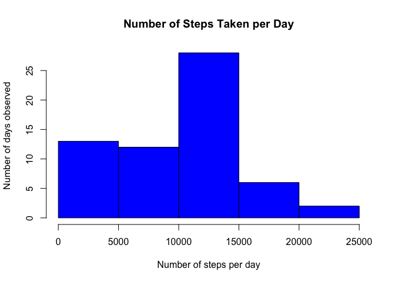
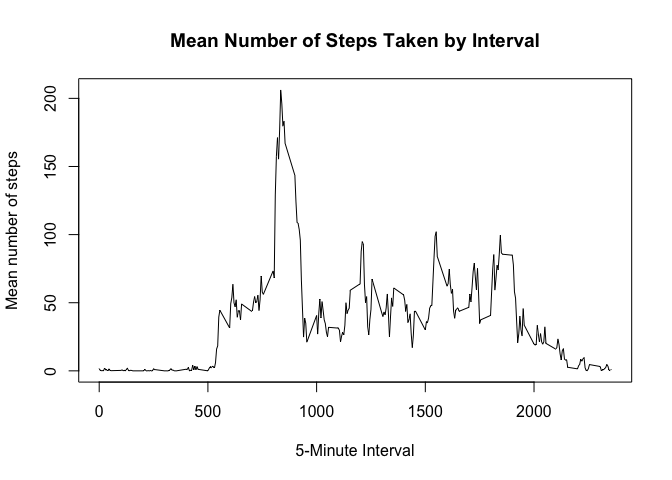
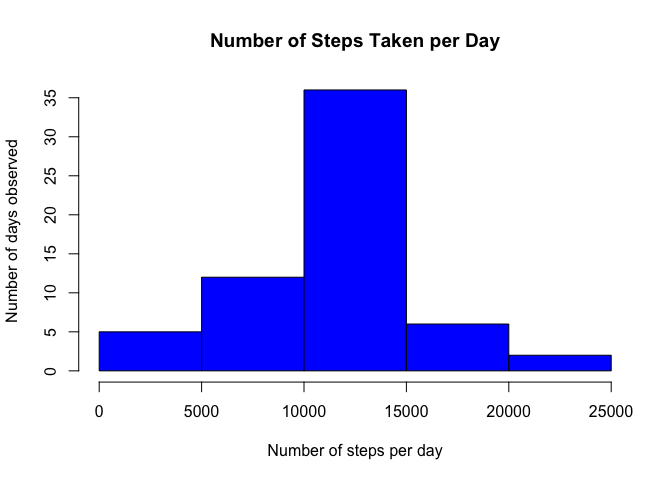
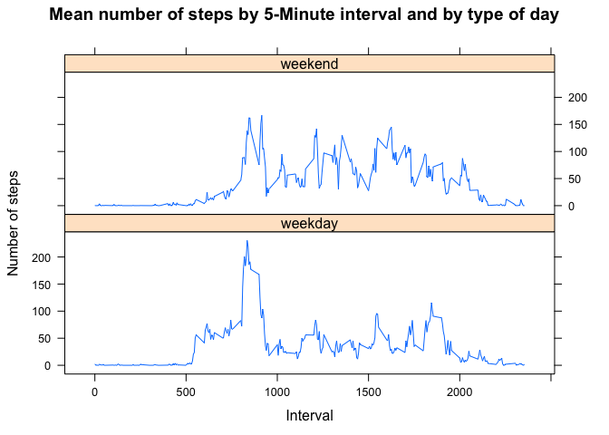

# Reproducible Research: Peer Assessment 1
Andrew Techmeier  
June 13, 2015  


## Loading and preprocessing the data
We begin by loading all of the R packages we need.  For this project, we are using plyr and lattice.


```r
library(plyr)
library(lattice)
```

We download the zip file containing the data, unzip, and load the subsequent data using read.csv().


```r
data_file_path <- "activity.csv"
if(!file.exists(data_file_path)) {
    url <- "https://d396qusza40orc.cloudfront.net/repdata%2Fdata%2Factivity.zip"
    download.file(url, destfile="./activity_data.zip", method="curl")
    unzip("./activity_data.zip")
}
data <- read.csv(data_file_path)
```

We observe the dataset has 17,568 observations with three columns:  steps, date, and interval.


```r
str(data)
```

```
## 'data.frame':	17568 obs. of  3 variables:
##  $ steps   : int  NA NA NA NA NA NA NA NA NA NA ...
##  $ date    : Factor w/ 61 levels "2012-10-01","2012-10-02",..: 1 1 1 1 1 1 1 1 1 1 ...
##  $ interval: int  0 5 10 15 20 25 30 35 40 45 ...
```


## What is mean total number of steps taken per day?

We would like to summarize the data by calculating the mean number of steps taken per day.  
To do this, we must begin by summing up all of the steps in any given day.  Note that we are ignoring all of the unobserved/missing NA steps.


```r
sum_by_day <- ddply(data, ~date, summarize, sum_steps=sum(steps, na.rm=TRUE))
```

Now that we have summed the steps by day, let's take a look at what the histogram looks like for number of steps per day:

```r
hist(sum_by_day$sum_steps, xlab="Number of steps per day", ylab="Number of days observed", col="blue", main = "Number of Steps Taken per Day")
```

 

We find that the mean and median are 9354.23 and 10395, respectively.

```r
mean_steps <- mean(sum_by_day$sum_steps)
median_steps <- median(sum_by_day$sum_steps)
mean_median <- data.frame(mean=mean_steps, median=median_steps)
mean_median
```

```
##      mean median
## 1 9354.23  10395
```


## What is the average daily activity pattern?

Now, we would like to understand the number of steps by 5-minute interval. We summarize by calculating the mean steps across all of the intervals on all days:

```r
mean_steps_taken <- ddply(data, ~interval, summarize, mean_steps=mean(steps, na.rm=TRUE))
plot(mean_steps_taken$interval, mean_steps_taken$mean_steps, type="l", ylab="Mean number of steps", xlab="5-Minute Interval", main="Mean Number of Steps Taken by Interval")
```

 

We notice that, on average, interval 835 has the maximum number of average steps at 206.1698:

```r
data.frame(max_interval = mean_steps_taken[which.max(mean_steps_taken$mean_steps), "interval"], max_steps = max(mean_steps_taken$mean_steps))
```

```
##   max_interval max_steps
## 1          835  206.1698
```

## Imputing missing values

Earlier, we ignored all missing step values.  We note that there are 2304 NA step values, with some entire days missing:

```r
data.frame(num_nas = sum(is.na(data$steps)))
```

```
##   num_nas
## 1    2304
```

In the last section, we calculated the mean number of steps in any given interval.  Since we are running analysis on the sums of steps and subsequent means per day, missing data will cause our data to be skewed lower.  Let's assume that all missing step values take the mean value within their respective interval.  We accomplish this by looping over the data and replacing any NA values with the mean from the data frame we created in the last section. 


```r
new_steps <- numeric()
for(i in seq_len(nrow(data))) {
    if(is.na(data[i,"steps"])) {
        steps <- mean_steps_taken[mean_steps_taken$interval == data[i,"interval"], "mean_steps"]
    }
    else {
        steps <- data[i,"steps"]
    }
    new_steps = c(new_steps, steps)
}
data_modified <- data
data_modified$steps <- new_steps
```

Now, let's re-create the mean analysis with the new data.


```r
sum_by_day_modified <- ddply(data_modified, ~date, summarize, sum_steps=sum(steps, na.rm=TRUE))
hist(sum_by_day_modified$sum_steps, xlab="Number of steps per day", ylab="Number of days observed", col="blue", main = "Number of Steps Taken per Day")
```

 

We notice that the mean and median steps per day has increased as expected.  Note the table below compares the means and medians from pre and post-treatment (lines 1 & 2, respectively).


```r
mean_steps_modified <- mean(sum_by_day_modified$sum_steps)
median_steps_modified <- median(sum_by_day_modified$sum_steps)
mean_median_modified <- data.frame(mean=mean_steps_modified, median=median_steps_modified)
rbind(mean_median, mean_median_modified)
```

```
##       mean   median
## 1  9354.23 10395.00
## 2 10766.19 10766.19
```

## Are there differences in activity patterns between weekdays and weekends?

Let's understand if there are any potential variances in steps taken between weekend and weekdays.  We define weekend days as Saturday and Sunday.  Let's create a new factor variable within our modified data which we just created in the last step.


```r
weekends <- c("Sunday", "Saturday")
data_modified$daytype <- factor(ifelse(weekdays(as.POSIXlt(data_modified$date)) %in% weekends, "weekend", "weekday"))
```

Now, let's look at what the mean steps are by 5-minute interval across different day types.  We note that the distribution of steps taken during the weekend are more spread out throughout the day, whereas they are concentrated in earlier time intervals on weekdays.


```r
mean_steps_taken_weekdays <- ddply(data_modified, .(interval,daytype), summarize, mean_steps=mean(steps, na.rm=TRUE))
xyplot(mean_steps ~ interval | daytype, data = mean_steps_taken_weekdays, layout = c(1,2), type = "l", ylab = "Number of steps", xlab = "Interval", main = "Mean number of steps by 5-Minute interval and by type of day")
```

 
